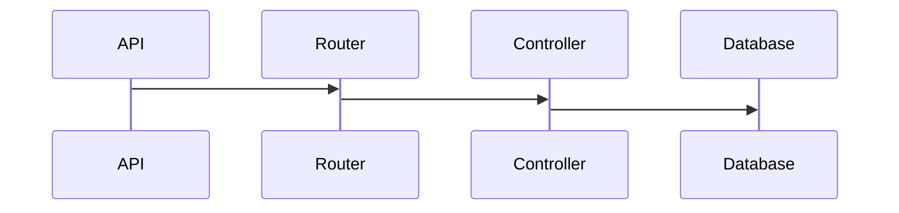

# App Lab API

Esta é uma aplicação exemplo que se destina a prover funcionalidades para o cadastro e manutenção de Laboratórios e Exames e suas associações.
As principais entidades desta aplicação são **Laboratório** e **Exame**. Laboratórios e Exames podem ser vinculados configurando uma **Associação**

## Visão geral de arquitetura
A arquitetura desta aplicação está baseada num modelo de **API REST**, protocolo HTTP,  com uma camada de  **routers** para os endpoints que são servidos por **controllers**. Os controllers se comunicam com a base de dados **MongoDb** por meio de uma abstração da camada de dados gerenciada pela framework **Mongoose**



# Documentação (Swagger)


Todas as operações disponíveis na API REST desta aplicação estão documentadas e podem ser testadas e acessadas por meio do Swagger na *url* https://x-app-lab.herokuapp.com/api-docs (*ou localmente em http://localhost:5000/api-docs*).


# Laboratórios
Para laboratórios a aplicação oferece as seguintes funcionalidades:

 - cadastrar um novo laboratório
 - obter uma lista de laboratórios ativos  
 - atualizar um laboratório existente
 - remover logicamente um laboratório ativo

Cada uma das funcionalidades é apresentada a seguir...
## Cadastrar laboratórios

Um laboratório pode ser cadastrado por meio de uma operação **POST** utilizando-se o request payload a seguir no endpoint '[/v1/laboratórios'](https://x-app-lab.herokuapp.com/api/v1/laborat%C3%B3rios)

    {
      "nome": "string",
      "endereco": "string"
    }

```bash
curl -X 'POST' \
  'http://localhost:5000/api/v1/laboratorios' \
  -H 'accept: application/json' \
  -H 'Content-Type: application/json' \
  -d '{
  "nome": "string",
  "endereco": "string"
}'
```

 **Cadastro em lote**
> É possível realizar o cadastro de um lote de até 10 laboratórios de uma única vez. Para tanto, deve ser utilizado o endpoint [/v1/lote/laboratorios](https://x-app-lab.herokuapp.com/api/v1/laboratorios). 
> O limite de 10 laboratórios pode ser alterado mudando o valor da variável de ambiente **TAMANHO_MAXIMO_LOTE** 

```bash
curl -X 'POST' \
  'http://localhost:5000/api/v1/lote/laboratorios' \
  -H 'accept: application/json' \
  -H 'Content-Type: application/json' \
  -d '[
  {
    "nome": "string",
    "endereco": "string"
  }
]'
```

 
## Obter uma lista laboratórios ativos

Para se obter uma lista de laboratórios ativos, basta invocar o endpoint [/v1/laboratorios](https://x-app-lab.herokuapp.com/api/v1/laboratorios) por meio de uma requisição **GET**. Para esta operação não são necessários parâmetros.

```bash
curl -X 'GET' \
  'http://localhost:5000/api/v1/laboratorios' \
  -H 'accept: application/json'
```

## Atualizar um laboratório

Os dados de um laboratório podem ser atualizados por meio de uma operação **PATCH** no endpoint [/v1/laboratorios/{id}](https://x-app-lab.herokuapp.com/api/v1/laboratorios). O **id** do laboratório deve ser informado na *url*, além disso, o *request* deve conter o *payload* com as demais dados que serão atualizados.
```bash
curl -X 'PATCH' \
  'http://localhost:5000/api/v1/laboratorios/61a23453f5412d' \
  -H 'accept: application/json' \
  -H 'Content-Type: application/json' \
  -d '{
  "nome": "string",
  "endereco": "string"
}'
```
 **Atualização em lote**
> É possível realizar a atualização de um lote de até 10 laboratórios de uma única vez. Para tanto, deve ser utilizado o endpoint [/v1/lote/laboratorios](https://x-app-lab.herokuapp.com/api/v1/laboratorios). 
> O limite de 10 laboratórios pode ser alterado mudando o valor da variável de ambiente **TAMANHO_MAXIMO_LOTE** 

```bash
curl -X 'PATCH' \
  'http://localhost:5000/api/v1/lote/laboratorios' \
  -H 'accept: application/json' \
  -H 'Content-Type: application/json' \
  -d '[
  {
    "nome": "string",
    "endereco": "string"
  }
]'
```
## Remover laboratórios

Para remover um laboratório uma operação **DELETE** deve ser realizada no endpoint [/v1/laboratorios/{id}](https://x-app-lab.herokuapp.com/api/v1/laboratorios). O **id** do laboratório deve ser informado na *url* requisitada.
```bash
curl -X 'DELETE' \
  'http://localhost:5000/api/v1/laboratorios/6a66643f6e7f5ed4' \
  -H 'accept: application/json'
```
 **Remove em lote**
> É possível realizar a remoção de um lote de até 10 laboratórios de uma única vez. Para tanto, deve ser utilizado o endpoint [/v1/lote/laboratorios](https://x-app-lab.herokuapp.com/api/v1/laboratorios). 
> O limite de 10 laboratórios pode ser alterado mudando o valor da variável de ambiente **TAMANHO_MAXIMO_LOTE** 

```bash
curl -X 'DELETE' \
  'http://localhost:5000/api/v1/lote/laboratorios' \
  -H 'accept: application/json' \
  -H 'Content-Type: application/json' \
  -d '[
  "id-do-objeto-1",
  "id-do-objeto-2"
]'
```
# Exames

Para laboratórios a aplicação oferece as seguintes funcionalidades:

 - cadastrar um novo exame   
 - obter uma lista de exames ativos   
 - atualizar um exame existente   
 - remover logicamente um exame ativo


## Cadastrar um novo exame

Um laboratório pode ser cadastrado por meio de uma operação **POST** utilizando-se o request payload a seguir no endpoint '[/v1/exames'](https://x-app-lab.herokuapp.com/api/v1/exames)
```bash
curl -X 'POST' \
  'http://localhost:5000/api/v1/exames' \
  -H 'accept: application/json' \
  -H 'Content-Type: application/json' \
  -d '{
  "nome": "string",
  "tipo": "string"
}'
```
 **Cadastro em lote**
> É possível realizar o cadastro de um lote de até 10 exames de uma única vez. Para tanto, deve ser utilizado o endpoint [/v1/lote/exames](https://x-app-lab.herokuapp.com/api/v1/exames). 
> O limite de 10 laboratórios pode ser alterado mudando o valor da variável de ambiente **TAMANHO_MAXIMO_LOTE** 

```bash
curl -X 'POST' \
  'http://localhost:5000/api/v1/lote/exames' \
  -H 'accept: application/json' \
  -H 'Content-Type: application/json' \
  -d '[
  {
    "nome": "string",
    "tipo": "string"
  }
]'
```

## Obter uma lista exames ativos

Para se obter uma lista de exames ativos, basta invocar o endpoint [/v1/exames](https://x-app-lab.herokuapp.com/api/v1/exames) por meio de uma requisição **GET**. Para esta operação não são necessários parâmetros.

```bash
curl -X 'GET' \
  'http://localhost:5000/api/v1/exames' \
  -H 'accept: application/json'
```

## Atualizar um exame existente

Os dados de um exame podem ser atualizados por meio de uma operação **PATCH** no endpoint [/v1/exames/{id}](https://x-app-lab.herokuapp.com/api/v1/exanes). O **id** do exame deve ser informado na *url*, além disso, o *request* deve conter o *payload* com as demais dados que serão atualizados.
```bash
curl -X 'PATCH' \
  'http://localhost:5000/api/v1/exames/6d5e66f3e4a6f' \
  -H 'accept: application/json' \
  -H 'Content-Type: application/json' \
  -d '{
  "nome": "string",
  "tipo": "string"
}'
```
 **Atualização em lote**
> É possível realizar a atualização de um lote de até 10 exames de uma única vez. Para tanto, deve ser utilizado o endpoint [/v1/lote/exames](https://x-app-lab.herokuapp.com/api/v1/exames). 
> O limite de 10 exames pode ser alterado mudando o valor da variável de ambiente **TAMANHO_MAXIMO_LOTE** 

```bash
curl -X 'PATCH' \
  'http://localhost:5000/api/v1/lote/exames' \
  -H 'accept: application/json' \
  -H 'Content-Type: application/json' \
  -d '[
  {
    "nome": "string",
    "tipo": "string"
  }
]'
```

## Remover logicamente um exame ativo

Para remover um exame uma operação **DELETE** deve ser realizada no endpoint [/v1/exames/{id}](https://x-app-lab.herokuapp.com/api/v1/exames). O **id** do laboratório deve ser informado na *url* requisitada.
```bash
curl -X 'DELETE' \
  'http://localhost:5000/api/v1/exames/6f4e5a6d4e326de' \
  -H 'accept: application/json'
```
 **Remove em lote**
> É possível realizar a remoção de um lote de até 10 exames de uma única vez. Para tanto, deve ser utilizado o endpoint [/v1/lote/exames](https://x-app-lab.herokuapp.com/api/v1/exames). 
> O limite de 10 laboratórios pode ser alterado mudando o valor da variável de ambiente **TAMANHO_MAXIMO_LOTE** 

```bash
curl -X 'DELETE' \
  'http://localhost:5000/api/v1/lote/exames' \
  -H 'accept: application/json' \
  -H 'Content-Type: application/json' \
  -d '[
  "string"
]'
```


# Associações

**Vincular  exames a  laboratórios**
Um exame pode ser associado a um ou mais laboratórios.
**POST** /api/v1/associacoes
    {
      "laboratorioId": "string",
      "exameId": "string"
    }

```bash
curl -X 'POST' \
  'http://localhost:5000/api/v1/associacoes' \
  -H 'accept: application/json' \
  -H 'Content-Type: application/json' \
  -d '{
  "laboratorioId": "string",
  "exameId": "string"
}'
```
**Desfazer vínculo entre  exames a  laboratórios**
A associação entre exames e laboratórios pode ser desfeita a qualquer momento. 
**DELETE** /api/v1/associacoes
    {
      "laboratorioId": "string",
      "exameId": "string"
    }

```bash
curl -X 'DELETE' \
  'http://localhost:5000/api/v1/associacoes' \
  -H 'accept: application/json' \
  -H 'Content-Type: application/json' \
  -d '{
  "laboratorioId": "string",
  "exameId": "string"
}'
```


## Execução da aplicação

A aplicação está implantada na plataforma **Heroku** e pode ser acessada na *url* https://x-app-lab.herokuapp.com/api-docs
Contudo, ela pode ser executada localmente com ou sem o uso de containers.

## Com container

Em ambiente local para que a API seja executada, será preciso digitar o comando abaixo no diretório raiz da aplicação:

    docker-compose up --build -d
A documentação da API poderá ser acessada na *url* http://localhost:5000/api-docs

## Sem container


Sem o uso de containers, e em ambiente local, a API poderá executada digitando o comando abaixo no diretório raiz da aplicação:

    npm run dev
A documentação da API poderá ser acessada na *url* http://localhost:5000/api-docs

> **IMPORTANTE:** Neste caso, é preciso ter uma instância de **MongoDb** em execução e disponível para a aplicação. As configurações de conexão com a base dados devem ser definidas no arquivo dev.env

