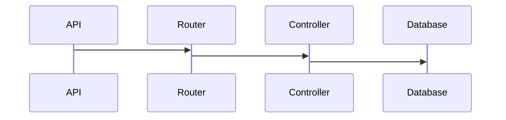

# App Lab API

Esta é uma aplicação exemplo que se destina a prover funcionalidades para o cadastro e manutenção de Laboratórios e Exames e suas associações.
As principais entidades desta aplicação são **Laboratório** e **Exame**. Laboratórios e Exames podem ser vinculados configurando uma **Associação**

## Visão geral de arquitetura
A arquitetura desta aplicação está baseada num modelo de **API REST**, protocolo HTTP,  com uma camada de  **routers** para os endpoints que são servidos por **controllers**. Os controllers se comunicam com a base de dados **MongoDb** por meio de uma abstração da camada de dados gerenciada pela framework **Mongoose**



# Documentação (Swagger)


Todas as operações disponíveis na API REST desta aplicação estão documentadas e podem ser testadas e acessadas por meio do Swagger em (http://localhost:5000/api-docs),.


# Laboratórios
Para laboratórios a aplicação oferece as seguintes funcionalidades:

 - cadastrar um novo laboratório
 - obter uma lista de laboratórios ativos  
 - atualizar um laboratório existente
 - remover logicamente um laboratório ativo

Cada uma das funcionalidades é apresentada a seguir...
## Cadastrar laboratórios

Um laboratório pode ser cadastrado por meio de uma operação **POST** utilizando-se o request payload a seguir no endpoint '[/v1/laboratórios'](/v1/laborat%C3%B3rios)

    {
      "nome": "string",
      "endereco": "string"
    }

```bash
curl -X 'POST' \
  'http://localhost:5000/api/v1/laboratorios' \
  -H 'accept: application/json' \
  -H 'Content-Type: application/json' \
  -d '{
  "nome": "string",
  "endereco": "string"
}'
```

 **Cadastro em lote**
> É possível realizar o cadastro de um lote de até 10 laboratórios de uma única vez. Para tanto, deve ser utilizado o endpoint [/v1/lote/laboratorios](/v1/laboratorios). 
> O limite de 10 laboratórios pode ser alterado mudando o valor da variável de ambiente **TAMANHO_MAXIMO_LOTE** 

```bash
curl -X 'POST' \
  'http://localhost:5000/api/v1/lote/laboratorios' \
  -H 'accept: application/json' \
  -H 'Content-Type: application/json' \
  -d '[
  {
    "nome": "string",
    "endereco": "string"
  }
]'
```

 
## Obter uma lista laboratórios ativos

Para se obter uma lista de laboratórios ativos, basta invocar o endpoint [/v1/laboratorios](/v1/laboratorios) por meio de uma requisição **GET**. Para esta operação não são necessários parâmetros.

```bash
curl -X 'GET' \
  'http://localhost:5000/api/v1/laboratorios' \
  -H 'accept: application/json'
```

## Atualizar um laboratório

Os dados de um laboratório podem ser atualizados por meio de uma operação **PATCH** no endpoint [/v1/laboratorios/{id}](/v1/laboratorios). O **id** do laboratório deve ser informado na *url*, além disso, o *request* deve conter o *payload* com as demais dados que serão atualizados.
```bash
curl -X 'PATCH' \
  'http://localhost:5000/api/v1/laboratorios/61a23453f5412d' \
  -H 'accept: application/json' \
  -H 'Content-Type: application/json' \
  -d '{
  "nome": "string",
  "endereco": "string"
}'
```
 **Atualização em lote**
> É possível realizar a atualização de um lote de até 10 laboratórios de uma única vez. Para tanto, deve ser utilizado o endpoint [/v1/lote/laboratorios](/v1/laboratorios). 
> O limite de 10 laboratórios pode ser alterado mudando o valor da variável de ambiente **TAMANHO_MAXIMO_LOTE** 

```bash
curl -X 'PATCH' \
  'http://localhost:5000/api/v1/lote/laboratorios' \
  -H 'accept: application/json' \
  -H 'Content-Type: application/json' \
  -d '[
  {
    "nome": "string",
    "endereco": "string"
  }
]'
```
## Remover laboratórios

Para remover um laboratório uma operação **DELETE** deve ser realizada no endpoint [/v1/laboratorios/{id}](/v1/laboratorios). O **id** do laboratório deve ser informado na *url* requisitada.
```bash
curl -X 'DELETE' \
  'http://localhost:5000/api/v1/laboratorios/6a66643f6e7f5ed4' \
  -H 'accept: application/json'
```
 **Remove em lote**
> É possível realizar a remoção de um lote de até 10 laboratórios de uma única vez. Para tanto, deve ser utilizado o endpoint [/v1/lote/laboratorios](/v1/laboratorios). 
> O limite de 10 laboratórios pode ser alterado mudando o valor da variável de ambiente **TAMANHO_MAXIMO_LOTE** 

```bash
curl -X 'DELETE' \
  'http://localhost:5000/api/v1/lote/laboratorios' \
  -H 'accept: application/json' \
  -H 'Content-Type: application/json' \
  -d '[
  "id-do-objeto-1",
  "id-do-objeto-2"
]'
```
# Exames

Para laboratórios a aplicação oferece as seguintes funcionalidades:

 - cadastrar um novo exame   
 - obter uma lista de exames ativos   
 - atualizar um exame existente   
 - remover logicamente um exame ativo


## Cadastrar um novo exame

Um laboratório pode ser cadastrado por meio de uma operação **POST** utilizando-se o request payload a seguir no endpoint '[/v1/exames'](/v1/exames)
```bash
curl -X 'POST' \
  'http://localhost:5000/api/v1/exames' \
  -H 'accept: application/json' \
  -H 'Content-Type: application/json' \
  -d '{
  "nome": "string",
  "tipo": "string"
}'
```
 **Cadastro em lote**
> É possível realizar o cadastro de um lote de até 10 exames de uma única vez. Para tanto, deve ser utilizado o endpoint [/v1/lote/exames](/v1/exames). 
> O limite de 10 laboratórios pode ser alterado mudando o valor da variável de ambiente **TAMANHO_MAXIMO_LOTE** 

```bash
curl -X 'POST' \
  'http://localhost:5000/api/v1/lote/exames' \
  -H 'accept: application/json' \
  -H 'Content-Type: application/json' \
  -d '[
  {
    "nome": "string",
    "tipo": "string"
  }
]'
```

## Obter uma lista exames ativos

Para se obter uma lista de exames ativos, basta invocar o endpoint [/v1/exames](/v1/exames) por meio de uma requisição **GET**. Para esta operação não são necessários parâmetros.

```bash
curl -X 'GET' \
  'http://localhost:5000/api/v1/exames' \
  -H 'accept: application/json'
```

## Atualizar um exame existente

Os dados de um exame podem ser atualizados por meio de uma operação **PATCH** no endpoint [/v1/exames/{id}](/v1/exanes). O **id** do exame deve ser informado na *url*, além disso, o *request* deve conter o *payload* com as demais dados que serão atualizados.
```bash
curl -X 'PATCH' \
  'http://localhost:5000/api/v1/exames/6d5e66f3e4a6f' \
  -H 'accept: application/json' \
  -H 'Content-Type: application/json' \
  -d '{
  "nome": "string",
  "tipo": "string"
}'
```
 **Atualização em lote**
> É possível realizar a atualização de um lote de até 10 exames de uma única vez. Para tanto, deve ser utilizado o endpoint [/v1/lote/exames](/v1/exames). 
> O limite de 10 exames pode ser alterado mudando o valor da variável de ambiente **TAMANHO_MAXIMO_LOTE** 

```bash
curl -X 'PATCH' \
  'http://localhost:5000/api/v1/lote/exames' \
  -H 'accept: application/json' \
  -H 'Content-Type: application/json' \
  -d '[
  {
    "nome": "string",
    "tipo": "string"
  }
]'
```

## Remover logicamente um exame ativo

You can rename the current file by clicking the file name in the navigation bar or by clicking the **Rename** button in the file explorer.


# Associações


The file explorer is accessible using the button in left corner of the navigation bar. You can create a new file by clicking the **New file** button in the file explorer. You can also create folders by clicking the **New folder** button.

## Atualizar exames

All your files and folders are presented as a tree in the file explorer. You can switch from one to another by clicking a file in the tree.

## Remover exames

You can rename the current file by clicking the file name in the navigation bar or by clicking the **Rename** button in the file explorer.


## Execução da aplicação

You can open a file from **Google Drive**, **Dropbox** or **GitHub** by opening the **Synchronize** sub-menu and clicking **Open from**. Once opened in the workspace, any modification in the file will be automatically synced.

## Save a file

You can save any file of the workspace to **Google Drive**, **Dropbox** or **GitHub** by opening the **Synchronize** sub-menu and clicking **Save on**. Even if a file in the workspace is already synced, you can save it to another location. StackEdit can sync one file with multiple locations and accounts.

## Synchronize a file

Once your file is linked to a synchronized location, StackEdit will periodically synchronize it by downloading/uploading any modification. A merge will be performed if necessary and conflicts will be resolved.

If you just have modified your file and you want to force syncing, click the **Synchronize now** button in the navigation bar.

> **Note:** The **Synchronize now** button is disabled if you have no file to synchronize.

## Manage file synchronization

Since one file can be synced with multiple locations, you can list and manage synchronized locations by clicking **File synchronization** in the **Synchronize** sub-menu. This allows you to list and remove synchronized locations that are linked to your file.


# Publication

Publishing in StackEdit makes it simple for you to publish online your files. Once you're happy with a file, you can publish it to different hosting platforms like **Blogger**, **Dropbox**, **Gist**, **GitHub**, **Google Drive**, **WordPress** and **Zendesk**. With [Handlebars templates](http://handlebarsjs.com/), you have full control over what you export.

> Before starting to publish, you must link an account in the **Publish** sub-menu.


# Markdown extensions

StackEdit extends the standard Markdown syntax by adding extra **Markdown extensions**, providing you with some nice features.

> **ProTip:** You can disable any **Markdown extension** in the **File properties** dialog.


